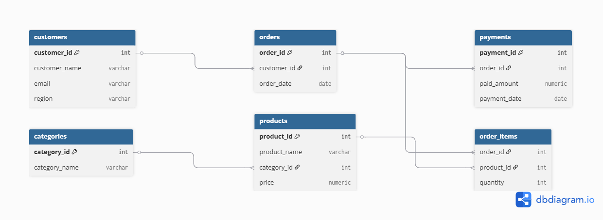

# 🧠 SQL Practice Project — Data Analytics for E-commerce Orders

## 📌 Mục tiêu
Đây là project luyện tập SQL được chia thành 3 cấp độ (Basic → Intermediate → Advanced), mô phỏng bài toán phân tích dữ liệu từ một hệ thống bán hàng thương mại điện tử.
---

## 📂 Dataset Structure

Dữ liệu mô phỏng gồm 6 bảng chính:

| Table Name      | Mô tả |
|------------------|-------|
| `customers`      | Thông tin khách hàng |
| `orders`         | Đơn hàng của khách |
| `order_items`    | Chi tiết từng sản phẩm trong mỗi đơn |
| `products`       | Danh sách sản phẩm |
| `categories`     | Danh mục sản phẩm |
| `payments`       | Thông tin thanh toán của đơn hàng |

---

## 🧱 ERD - Entity Relationship Diagram

---

## 🧪 SQL Levels & Challenges

### 🟢 Level 1 — Basic Queries
- SELECT cơ bản
- JOIN 2 bảng
- Sắp xếp kết quả

### 🟡 Level 2 — Aggregation & Window Functions
- SUM, COUNT, GROUP BY
- CTE, Window function: `ROW_NUMBER`, `LAG`

### 🔴 Level 3 — Advanced Analysis
- MoM Growth
- Ranking theo nhiều chiều
- Truy vấn lồng, xử lý đồng hạng
- Truy vấn phân tích hành vi khách hàng

---

## ✅ Tech Stack
- PostgreSQL
- ERD: dbdiagram.io (hoặc draw.io)
- SQL queries organized per level

---

## 📎 Repo structure
---

📁 sql/
├── level_1_basic.sql
├── level_2_intermediate.sql
├── level_3_advanced.sql
📁 schema/
├── create_tables.sql
schema.png
README.md

## 🌟 Tác giả

**Tran Quoc Thang**  
Fresher Data Engineer  
📧 Email: thangtranquoc1805@gmail.com  
📌 Dự án cá nhân nhằm luyện tập SQL cho Data Engineer

---